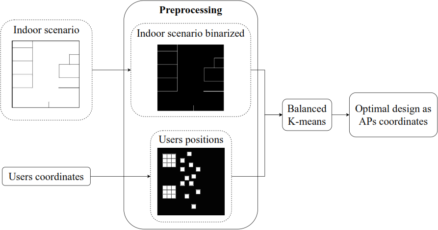

# WLANs optimal designs methodology

We introducing a software implemented in [Matlab](www.mathworks.com/products/matlab.html "Matlab"), which use the [Balanced k-means](https://link.springer.com/chapter/10.1007/978-3-662-44415-3_4) algorithm and the [IEEE 802.11ax channel model](mentor.ieee.org/802.11/dcn/14/11-14-0882-04-00ax-tgax-channel-model-document.docx "IEEE 802.11ax channel model") para obtener diseños óptimos de WLANs. EL software entrega diseños óptimos para las configuraciones de 1 a 5 APs en escenarios interiores en forma de coordenadas de posiciones dentro del espacio y dependiendo de la cantidad de clusters.

This tool processes RGB or grayscale plans, where the walls are represented by black pixels, while the open spaces are depicted by white pixels. With a simple modification in the code, you can customize the file paths to read or save the desired data.

Aditionaly, the software require to read a users postions's set. These ones can be to loaded like matrix or the code could be modified to generate these one here.

Is available the code to generate the random postions users set, too. Is important know that these ones are generated according the plan expected size.

The next image show process to calculate optimal desings:



Execute the principal archive [index](https://github.com/johanflorez98/WLANs-optimal-designs-methodology/blob/main/Codes/Balanced%20k-means/index.m).

## Cite as
```
  @software{andres_j_florez_gonzalez_2023_8378219,
  author       = {Andres J. Florez-Gonzalez. and
                  Carlos A. Viteri-Mera.},
  title        = {WLANs optimal designs methodology},
  month        = sep,
  year         = 2023,
  publisher    = {Zenodo},
  version      = {v1.0},
  doi          = {10.5281/zenodo.8378219},
  url          = {https://doi.org/10.5281/zenodo.8378219}
  }
```
